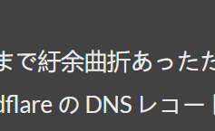
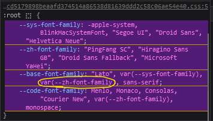
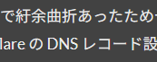

2 年半前、持て余していたドメインを使うため雑に構築し (、放置してい) た本ブログだが、なんとなく [Anatole](https://github.com/lxndrblz/anatole) を使っていた。
でも色々と不満点があったため、以下の要件のもと別テーマに移行することとした。
- PC から見たときに記事本文の左右に十分な余白があり読みやすい
- 検索機能がある
- タグ機能がある
- 投稿年から記事を探せる

[Hugo Themes](https://themes.gohugo.io/tags/blog/) を眺め、スターが多く上記を満たし見た目もいい感じなものを探すと [Stack](https://themes.gohugo.io/themes/hugo-theme-stack/) が見つかった。

ちなみに現状だとタグ機能も投稿年から探す機能も使っていないが、これは記事が少なすぎてまだ必要ないため。増えたら使う。

## 導入と設定の方法

Ubuntu なら:

```console
$ sudo apt install golang-go hugo # Go が必須
$ hugo mod init kamasaki.net/blog
$ hugo mod get github.com/CaiJimmy/hugo-theme-stack/v3 && hugo mod tidy
$ mkdir -p config/_default && cat <<EOF > config/_default/module.toml
[[imports]]
path = "github.com/CaiJimmy/hugo-theme-stack/v3"
EOF
```

設定は [hugo-theme-stack-starter](https://github.com/CaiJimmy/hugo-theme-stack-starter/tree/master/config/_default) を参考にすればよい。

## 日本語フォントが変

Android の Firefox から見ると普通なのに、Windows の Firefox から見るとフォントに中国を感じる。
`about:preferences` から「ウェブページが指定したフォントを優先する」のチェックを外すと日本語らしくなるので、Stack がおかしなフォントを指定しているようだ。



開発者ツールから有効なスタイルを調べると怪しいフォントを発見。中国語の言語コードって `zh` なんですね。
消してみると日本語フォントになったため、これを使わないように Stack を設定してやろう。



[ドキュメント](https://stack.jimmycai.com/config/header-footer#example-custom-font-family-for-article-content)にカスタマイズの具体例が載っているので参考にする。
今回は `--zh-font-family` を Noto Sans JP にしてしまう。
`layouts/partials/head/custom.html` に以下のようなコードを置いてやろう。
```html
<style>
    /* Overwrite CSS variable */
    :root {
        --zh-font-family: "Noto Sans JP";
    }
</style>

<script>
    (function () {
        const customFont = document.createElement('link');
        customFont.href = "https://fonts.googleapis.com/css2?family=Noto+Sans+JP:wght@400;700&display=swap";
    
        customFont.type = "text/css";
        customFont.rel = "stylesheet";
    
        document.head.appendChild(customFont);
    }());
</script>

```

ビルドし直すと Noto Sans JP が使われるようになった。



しかし、言語コードとして `ja-jp` が指定されていたら自動で日本語フォントを使って欲しいので、暇があったら PR を出したいところ。

## TOC を表示できない

[SEO が理由で](https://discourse.gohugo.io/t/why-does-markup-tableofcontents-startlevel-default-to-2/33963) `hugo-theme-stack-starter` の (Hugo の?) 初期設定だとレベル 1 の見出しは TOC に現れません[^stack-uses-h2-for-title]。

```toml
[tableOfContents]
endLevel = 4
ordered = true
startLevel = 2
```

見出しはレベル 2 以上にしましょう。

## おまけ

[Shortcodes](https://gohugo.io/content-management/shortcodes/)の使用例として、最近聴いてよかった曲を置いておく。



[^stack-uses-h2-for-title]: リンク先だと「タイトルがページ内の唯一の `<h1>` であるべき」と言われているが、Stack はタイトルに `<h2>` を使っているようで少し不自然だ。
